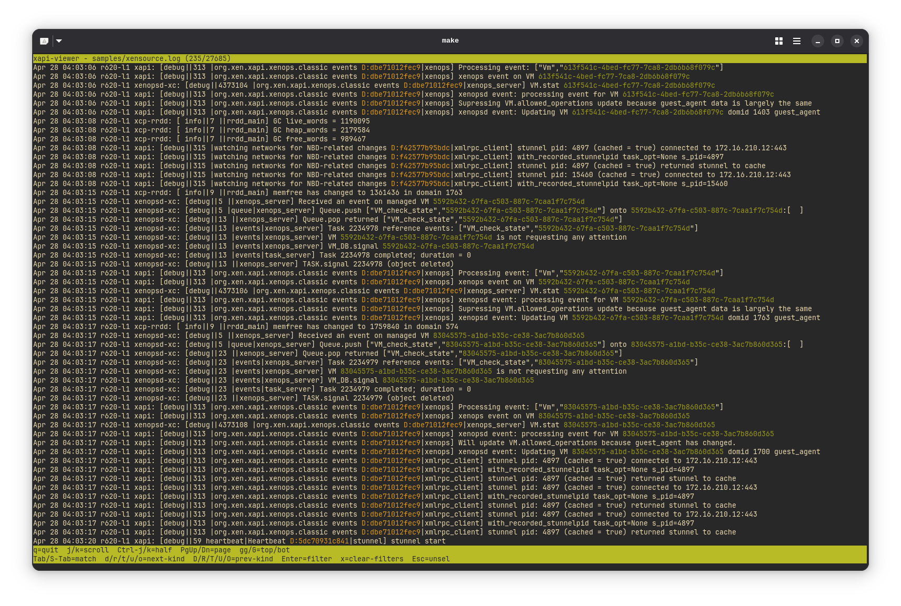

# Status

- Currently we have a pager. We can load logs and scroll with highlights of keywords like `OpaqueRef`, `Uuid`, `TaskId`, `D:xxxx` and `T:xxxx`.
- Next steps:
  - Filter by keywords
  - Load multiple files
  - Cross-reference with the XAPI database
- Run: `cargo run -- samples/xenstore.log 2>/tmp/debug.log`
  - Use your own logs
  - Don't forget to redirect stderr.
- Here is a screenshot


# Setup

- To setup the project we are using `rustup` from Nix, but the actual Rust toolchain lives in `~/.rustup`, managed by us.
  - *TODO*: check `rust-overlay`.

```nix
{ pkgs ? import <nixpkgs> {} }:

pkgs.mkShell {
  buildInputs = with pkgs; [
    # Rust toolchain manager
    rustup

    # Dev tools not handled by rustup
    bacon

    # Fast linker (big win)
    lld
  ];

  # Ensures rust-analyzer works properly
  RUST_SRC_PATH = "${pkgs.rustPlatform.rustLibSrc}";

  # Faster builds
  RUSTFLAGS = "-C link-arg=-fuse-ld=lld";

  # Fix rustup home so it doesn't fight with nix shells
  shellHook = ''
    export RUSTUP_HOME=$HOME/.rustup
    export CARGO_HOME=$HOME/.cargo
    export PATH=$CARGO_HOME/bin:$PATH

    echo ""
    echo "🦀 Rust dev shell (Nix + rustup)"
    echo "--------------------------------"
    echo "• rustup is provided by Nix"
    echo "• bacon is provided by Nix"
    echo ""
    echo "⚠️  You still need to install Rust tools via rustup:"
    echo "   rustup default stable"
    echo "   rustup component add rustfmt clippy rust-analyzer"
    echo ""
  '';
}
```
